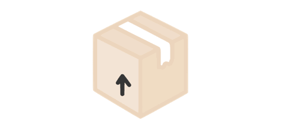

<div align="center">

# bxd



BoxDB is a promise-based browser ORM for [IndexedDB](https://developer.mozilla.org/en-US/docs/Web/API/IndexedDB_API)

  <a href="https://github.com/leegeunhyeok/bxd/actions?query=workflow:build" alt="Github actions">
    
  </a>
  <a href="https://lgtm.com/projects/g/leegeunhyeok/bxd/context:javascript" alt="lgtm">
    
  </a>
  <a href="https://codecov.io/gh/leegeunhyeok/bxd" alt="codecov">
    
  </a>
  <a href="https://www.npmjs.com/package/bxd" alt="npm">
    
  </a>
  <a href="https://www.npmjs.com/package/bxd">
    
  </a>
  <a href="https://www.npmjs.com/package/bxd">
    
  </a>
  <a href="https://www.npmjs.com/package/bxd">
    
  </a>
  
  

</div>

```typescript
import BoxDB from 'bxd';

const db = new BoxDB('my-datebase', 1);

// Define your box (Object store)
const User = db.box('user', {
  id: {
    type: BoxDB.Types.NUMBER,
    key: true, // This property is in-line-key
  },
  name: {
    type: BoxDB.Types.STRING,
    index: true, // This property is index
  },
  age: BoxDB.Types.NUMBER,
});

await db.open();

// Basics
await User.add({ id: 1, name: 'Tom', age: 10 });
await User.get(1);
await User.put({ id: 1, name: 'Tommy', age: 12 });
await User.delete(1);

// find(range, ...filters) method using IDBCursor
// Get records
const records = await User.find().get();

// filter & sort & limit
await User.find(
  null,
  (user) => user.id % 2 !== 0,
  (user) => user.age > 10,
  (user) => user.name.includes('y'),
).get(BoxDB.Order.DESC, 10);

// Update records (with filter)
await User
  .find(null, (user) => user.age !== 0)
  .update({ name: 'Timmy' });

// Delete records (with IDBValidKey & IDBRange + IDBIndex)
await User
  .find({
    value: BoxDB.Range.equal('Timmy'),
    index: 'name',
  })
  .delete();

// Do multiple tasks in one transaction
await db.transaction(
  User.$put({ id: 1, name: 'Tim', age: 20 }),
  User.$add({ id: 2, name: 'Jessica', age: 15 }),
  User.$add({ id: 3, name: 'Ellis', age: 13 }),
  User
    .$find({ value: 3 })
    .put({ name: 'Tina' }),
  BoxDB.interrupt(); // You can stop transaction like this!
  User.$delete(2),
  User
    .$find(null, (user) => user.age < 20)
    .put({ name: 'Young' }),
);

// And other IndexedDB API features!
await User.count(); // Get all records count
await User.clear(); // Clear all records
```

## 📃 Table of Contents

- [Features](#-features)
- [Browsers Support](#-browsers-support)
- [Installation](#-installation)
- [Documentation](#-documentation)
- [Example](#-example)
- [Issue](#-issue)
- [Development](#-development)
- [Resources](#-resources)
- [License](#-license)

## 🌟 Features

- Promise based ORM
- User friendly and easy to use
- Lightweight(< 10kb) IndexedDB wrapper
- Zero dependency
- Database and object store version management
- Data validation and transaction control via model (box)
- ACID(Atomicity, Consistency, Isolation, Durability) guaranteed with transaction
- Supports TypeScript
- Works on [Web workers](https://developer.mozilla.org/en-US/docs/Web/API/Web_Workers_API)

## 🌍 Browsers Support

| </br>IE | </br>Edge | </br>Firefox | </br>Chrome | </br>Safari | </br>iOS Safari | </br>Samsung | </br>Opera |
| ---------------------------------------------------------------------------------------------------------------------------------------------------------------- | ------------------------------------------------------------------------------------------------------------------------------------------------------------------ | ------------------------------------------------------------------------------------------------------------------------------------------------------------------------ | ---------------------------------------------------------------------------------------------------------------------------------------------------------------------- | ---------------------------------------------------------------------------------------------------------------------------------------------------------------------- | ------------------------------------------------------------------------------------------------------------------------------------------------------------------------------ | ------------------------------------------------------------------------------------------------------------------------------------------------------------------------ | -------------------------------------------------------------------------------------------------------------------------------------------------------------------- |
| 11                                                                                                                                                               | 12~                                                                                                                                                                | 10~                                                                                                                                                                      | 23~                                                                                                                                                                    | 10~                                                                                                                                                                    | 10~                                                                                                                                                                            | 4~                                                                                                                                                                       | 15~                                                                                                                                                                  |

- Test features in your browser [here](https://bxd.vercel.app/demo.html).
- Checkout `IE11` test [here](https://bxd.vercel.app/ie).

## 🛠 Installation

```bash
npm install bxd
```

In script tag:

```html
<script src="https://cdn.jsdelivr.net/npm/bxd@latest/dist/bxd.min.js"></script>
```

Looking for IE? Go to [this page](https://bxd.vercel.app/ie)

## 📖 Documentation

Go to [documentation](https://bxd.vercel.app)!

## 🌱 Example

[Example](https://bxd.vercel.app/example)

## 🔥 Issue

Opening an issue or feature request [here](https://github.com/leegeunhyeok/bxd/issues)

## 👨‍💻 Development

```bash
# Install dependencies
npm install

# Test
npm run test

# Build
npm run build
```

## 🎨 Resources

- Logo based on [Icon Fonts](http://www.onlinewebfonts.com/icon) (by CC BY 3.0)

## 🍀 License

[MIT](./LICENSE)
