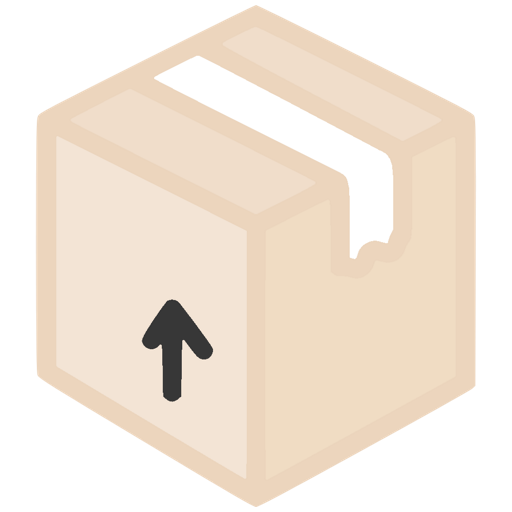

<div align="center">

# bxd



Object relation mapping for [IndexedDB](https://developer.mozilla.org/en-US/docs/Web/API/IndexedDB_API)

  <a href="https://github.com/leegeunhyeok/bxd/actions?query=workflow:build" alt="Github actions">
    
  </a>
  <a href="https://codecov.io/gh/leegeunhyeok/bxd" alt="codecov">
    
  </a>
  <a href="https://www.npmjs.com/package/bxd" alt="npm">
    
  </a>
  
  

</div>

```typescript
const tom = { _id: 1, name: 'Tom', age: 10 };
const users = [
  tom,
  { _id: 2, name: 'Jessica', age: 12 },
  { _id: 3, name: 'Ellis', age: 15 },
  { _id: 4, name: 'John', age: 11 },
  { _id: 5, name: 'Unknown', age: -1 },
];

// Add all data
for (const user of users) {
  await User.add(user);
}
await User.put({ ...tom, age: 15 }); // Update tom's age to 15
await User.get(1); // { _id: 1, name: 'Tom', age: 15 }
await User.delete(3); // Delete record that `_id` is 3

// Get records that `age` is not -1 and over 10 and "i" character included in `name` value
await User.find([
  (user) => user.age !== -1,
  (user) => user.age > 10,
  (user) => user.name.indexOf('i') !== -1,
]).get();

// Delete records that `age` is negative number
await User.find([(user) => user.age < 0]).delete();

// Update records that `_id` is even number
await User.find([(user) => user._id % 2 === 0]).put({ age: 12 }); // `age` to 12

// Run multiple tasks via transaction
// 1. Update tom's age
// 2. Add new record
// 3. Delete records that `age` < 20
// : If error occurs during transaction, rollback to before transaction
await box.transaction([
  User.task.put({ ...tom, age: 20 }),
  User.task.add({ _id: 6, name: 'Hans', age: 22 }),
  User.task.find([(user) => user.age < 20]).delete(),
]);
```

## Table of Contents

- [Features](#features)
- [Browser Support](#browser-support)
- [Installation](#installation)
- [Documentation](#documentation)
  - [BoxDB](#boxdb)
    - [BoxDB.Types](#boxdbtypes) `static`
    - [BoxDB.interrupt](#boxdbinterrupt) `static`
    - [BoxDB.on(type, listener)](#boxdbon)
    - [BoxDB.off(type, listener)](#boxdboff)
    - [BoxDB.model(targetVersion)](#boxdbmodel)
    - [BoxDB.open()](#boxdbopen)
    - [BoxDB.transaction](#boxtransaction)
  - [BoxModelRegister()](#boxmodelregister)
  - [BoxScheme](#boxscheme)
  - [BoxOption](#boxoption)
  - [BoxModel](#boxmodel)
    - [BoxModel.add(value[, key])](#boxmodeladd)
    - [BoxModel.get(key)](#boxmodelget)
    - [BoxModel.put(value[, key])](#boxmodelput)
    - [BoxModel.delete(key)](#boxmodeldelete)
    - [BoxModel.find([filter])](#boxmodelfind)
    - [BoxModel.clear()](#boxmodelclear)
    - [BoxModel.drop()](#boxmodeldrop)
  - [BoxData](#boxdata)
  - [BoxTask](#boxtask)
    - [BoxTask.add(value[, key])](#boxtaskadd)
    - [BoxTask.put(value[, key])](#boxtaskput)
    - [BoxTask.delete(key)](#boxtaskdelete)
    - [BoxTask.find(value[, key])](#boxtaskfind)
  - [BoxCursorHandler](#boxcursorhandler)
    - [BoxCursorHandler.get()](#boxcursorhandlerget)
    - [BoxCursorHandler.update(value)](#boxcursorhandlerupdate)
    - [BoxCursorHandler.delete()](#boxcursorhandlerdelete)
  - [BoxCursorTask](#boxcursortask)
    - [BoxCursorTask.update()](#boxcursortaskupdate)
    - [Boxcursortask.delete()](#boxcursortaskdelete)
- [Example](#example)
  - [Basic](#basic)
  - [Version management](#version-management)
  - [Transaction](#transaction)
- [Development](#development)
- [Resources](#resources)
- [License](#license)

### Features

- [x] Promise based and easy to use
- [x] Zero dependencies
- [x] Database and object store version management
- [x] Transaction control and data validation via model
- [x] ACID(Atomicity, Consistency, Isolation, Durability) guaranteed with transaction
- [x] Supports TypeScript

### Browser Support

> WIP..

### Installation

```bash
npm install --save bxd
```

In browser:

> Maybe polyfills required if load BoxDB via script tag

```html
<script src="/path/to/bxd.js"></script>
```

In browser (legacy):

```html
<!-- Polyfills required -->
<script src="https://polyfill.io/v3/polyfill.min.js?features=Symbol%2CSymbol.asyncIterator%2CSymbol.prototype.description%2CSymbol.iterator%2CArray.prototype.indexOf%2CArray.prototype.%40%40iterator%2CObject.assign%2CObject.getOwnPropertyDescriptor%2CObject.setPrototypeOf%2CPromise%2CString.prototype.%40%40iterator"></script>
<script src="/path/to/bxd.min.js">
```

|     Target     | Polyfill (Based on core-js 3)         |
| :------------: | :------------------------------------ |
| `IE10`, `IE11` | es.symbol                             |
| `IE10`, `IE11` | es.symbol.description                 |
| `IE10`, `IE11` | es.symbol.async-iterator              |
| `IE10`, `IE11` | es.symbol.iterator                    |
| `IE10`, `IE11` | es.array.concat                       |
| `IE10`, `IE11` | es.array.index-of                     |
| `IE10`, `IE11` | es.array.iterator                     |
| `IE10`, `IE11` | es.object.assign                      |
| `IE10`, `IE11` | es.object.get-own-property-descriptor |
|     `IE10`     | es.object.set-prototype-of            |
| `IE10`, `IE11` | es.object.to-string                   |
| `IE10`, `IE11` | es.promise                            |
| `IE10`, `IE11` | es.string.iterator                    |
| `IE10`, `IE11` | web.dom-collections.iterator          |

### Documentation

> All of features follows IndexedDB mechanism

#### BoxDB

> The BoxDB class for IndexedDB and object stores management

```javascript
const box = new BoxDB(databaseName, version);
```

Parameters

- **databaseName**: `string`
  - Name of the database
- **version**: `number`
  - Version to open the database with

Properties

- [BoxDB.Types](#boxdbtypes) `static`
- **databaseName**: `string`
  - Database name
- **version**: `number`
  - Database version
- **ready**: `boolean`
  - Database ready status

Methods

- [BoxDB.interrupt](#boxdbinterrupt) `static`
- [addEventListener()](#boxdbaddeventlistener)
- [removeEventListener()](#boxdbremoveeventlistener)
- [model()](#boxdbmodel)
- [open()](#boxdbopen)
- [transaction()](#boxdbtransaction)

##### BoxDB.Types

> The BoxDB.Types is constant value to specify model data type

```javascript
BoxDB.Types;

// Properties
BoxDB.Types.BOOLEAN;
BoxDB.Types.NUMBER;
BoxDB.Types.STRING;
BoxDB.Types.DATE;
BoxDB.Types.ARRAY;
BoxDB.Types.OBJECT;
BoxDB.Types.REGEXP;
BoxDB.Types.FILE;
BoxDB.Types.BLOB;
BoxDB.Types.ANY;
```

Properties

- **BoxDB.Types.BOOLEAN**: for [Boolean](https://developer.mozilla.org/en-US/docs/Web/JavaScript/Reference/Global_Objects/Boolean) value
- **BoxDB.Types.NUMBER**: for [Number](https://developer.mozilla.org/en-US/docs/Web/JavaScript/Reference/Global_Objects/Number) value
- **BoxDB.Types.STRING**: for [String](https://developer.mozilla.org/en-US/docs/Web/JavaScript/Reference/Global_Objects/String) value
- **BoxDB.Types.DATE**: for [Date](https://developer.mozilla.org/en-US/docs/Web/JavaScript/Reference/Global_Objects/Date) value
- **BoxDB.Types.ARRAY**: for [Array](https://developer.mozilla.org/en-US/docs/Web/JavaScript/Reference/Global_Objects/Array) value
- **BoxDB.Types.OBJECT**: for [Object](https://developer.mozilla.org/en-US/docs/Web/JavaScript/Reference/Global_Objects/Object) value
- **BoxDB.Types.REGEXP**: for [RegExp](https://developer.mozilla.org/en-US/docs/Web/JavaScript/Reference/Global_Objects/RegExp) value
- **BoxDB.Types.FILE**: for [File](https://developer.mozilla.org/en-US/docs/Web/API/File) value
- **BoxDB.Types.BLOB**: for [Blob](https://developer.mozilla.org/en-US/docs/Web/API/Blob) value
- **BoxDB.Types.ANY**: for _any_ value (Skip type checking)

##### BoxDB.interrupt()

> WIP...

##### BoxDB.on()

> WIP...

##### BoxDB.off()

> WIP...

##### BoxDB.model()

> The model() method of the BoxDB interface first step of define new model

```javascript
box.model(targetVersion);
```

Parameters

- **targetVersion**: `number`
  - Version of create or update the object store when [onupgradeneeded](https://developer.mozilla.org/en-US/docs/Web/API/IDBOpenDBRequest/onupgradeneeded) event fired

Return value

- **[BoxModelRegister](#boxmodelregister)**

##### BoxDB.open()

> The `open()` method of the BoxDB interface open idb and create/update/delete object store based on registered models

```javascript
box.open();
```

Return value

- **Promise<[Event](https://developer.mozilla.org/en-us/docs/Web/API/Event)>**

##### BoxDB.transaction()

> WIP...

#### BoxModelRegister()

> The `BoxModelRegister` returns new model based on target version and scheme and options

```javascript
const modelRegister = box.model(1);
const Model = modelRegister(storeName, scheme[, option]);

// also can use like this (function chaining)
const Model = box.model(1)(storeName, scheme[, options]);
```

Parameters

- **storeName**: `string`
  - Name of the object store
- **scheme**: [BoxScheme](#boxscheme)
  - Data scheme of the data to store
- **options**: [BoxOption](#boxoption) (`optional`)
  - Object store options

Return value

- **[BoxModel](#boxmodel)**

#### BoxScheme

> The `BoxScheme` is definition object for field name and data type and key/index options mapping

```typescript
interface BoxScheme {
  [field: string]: ConfiguredType | BoxDataTypes;
}

// BoxDB.Types
export enum BoxDataTypes {
  BOOLEAN = 'boolean',
  NUMBER = 'number',
  STRING = 'string',
  DATE = 'date',
  ARRAY = 'array',
  OBJECT = 'object',
  REGEXP = 'regexp',
  FILE = 'file',
  BLOB = 'blob',
  ANY = 'any',
}

type ConfiguredType = {
  type: BoxDataTypes;
  key?: boolean;
  index?: boolean;
  unique?: boolean;
};
```

```javascript
// Example
const scheme = {
  // Method 1. Define in detail
  name: {
    type: BoxDB.Types.STRING,
    index: true,
    unique: true,
  },
  // Method 2. Only type (No key, No index)
  age: BoxDB.Types.NUMBER,
};
```

Options

- **type**: [BoxDB.Types](#boxdbtypes)
  - Type of this property (used by type checking)
- **key**: `boolean` (`optional`)
  - Set this property as [out-of-line key](https://developer.mozilla.org/en-US/docs/Web/API/IndexedDB_API/Basic_Concepts_Behind_IndexedDB#gloss_outofline_key)
  - Can not change out-of-line key after versions of this model
    - **_If you want change, create new model after drop_**
- **index**: `boolean` (`optional`)
  - [Create](https://developer.mozilla.org/en-US/docs/Web/API/IDBObjectStore/createIndex) or [delete](https://developer.mozilla.org/en-US/docs/Web/API/IDBObjectStore/deleteIndex) index for this property
  - If you want search this property values by index, must enable
- **unique**: `boolean` (`optional`)
  - Add [unique constraint](https://developer.mozilla.org/en-US/docs/Web/API/IDBObjectStore/createIndex#parameters) to this property's index
    - **_`index` option required_**

#### BoxOption

> Object store options

```typescript
interface BoxOption {
  autoIncrement?: boolean;
}
```

- **autoIncrement**: `boolean`
  - Use [in-line key](https://developer.mozilla.org/en-US/docs/Web/API/IndexedDB_API/Basic_Concepts_Behind_IndexedDB#gloss_inline_key) for this object store
  - For [autoIncrement](https://developer.mozilla.org/en-US/docs/Web/API/IDBObjectStore/autoIncrement) flag

#### BoxModel

> The BoxModel object can be control specified object store or use as value

```javascript
const User = box.model(1)('user', {
  _id: {
    type: BoxDB.Types.NUMBER,
    key: true,
  }
  name: {
    type: BoxDB.Types.STRING,
    index: true,
  }
  age: BoxDB.Types.NUMBER,
  email: BoxDB.Types.STRING
});

// Model as constructor
new User();

// Model methods for single transactions
User.get(key);
User.put(value, key);
User.delete();
User.clear();
User.drop();
User.find(filters).get();
User.find(filters).update(value);
User.find(filters).delete();

// Returns TransactionTask for BoxDB.transaction()
User.task.get(key);
User.task.put(key, value);
User.task.delete();
User.task.find(filters).update(value);
User.task.find(filters).delete();
```

Parameters

- **storeName**: `string`
  - Name of the object store
- **scheme**: [BoxScheme](#boxscheme)
  - Data scheme of the data to store
- **options**: [BoxOption](#boxoption) (`optional`)
  - Object store options

Properties

- **task**: [BoxTask](#boxtask)

Methods

- Model.add(value, key): Add record to object store
- Model.get(key): Get record from object store
- Model.put(value[, key]): Put record to object store
- Model.delete(key): Delete record from object store
- Model.clear(key): Clear all records from object store
- Model.drop(key): Drop the object store
- Model.find([, filters]): Returns `BoxCursorHandler`, Transaction by [cursor](https://developer.mozilla.org/en-US/docs/Web/API/IDBCursor)
  - find().get(): Get all of records
  - find().update(value): Update records
  - find().delete(): Delete records

##### BoxModel.add()

> WIP...

##### BoxModel.get()

> The `get()` method of the BoxModel inteface returns an specific record data from object store

##### BoxModel.put()

> WIP...

##### BoxModel.delete()

> WIP...

##### BoxModel.find()

> WIP...

##### BoxModel.clear()

> WIP...

##### BoxModel.drop()

> WIP...

#### BoxData

> Type of object based on model's [BoxScheme](#boxscheme)

```typescript
// Sample model
const User = box.model(1)('user', {
  _id: {
    type: BoxDB.Types.NUMBER,
    key: true,
  }
  name: {
    type: BoxDB.Types.STRING,
    index: true,
  }
  age: BoxDB.Types.NUMBER,
  email: BoxDB.Types.STRING
});

// User model based BoxData will be inferenced like this
type BoxData = {
  _id: number
  name: string,
  age: number,
  email: string
}

// Sample data
const data = {
  _id: 1,
  name: 'Tom',
  age: 12,
  email: 'tom@host.com'
};
```

#### BoxTask

> Set of methods that return [TransactionTask](#transactiontask) for use in `BoxDB.transaction()`

```typescript
interface BoxTask<S extends BoxScheme> {
  add: (value: BoxData<S>, key?: IDBValidKey) => TransactionTask;
  put: (value: BoxData<S>, key?: IDBValidKey) => TransactionTask;
  delete: (
    key: string | number | Date | ArrayBufferView | ArrayBuffer | IDBArrayKey | IDBKeyRange,
  ) => TransactionTask;
  find: (filter?: BoxModelFilter<S>) => BoxTaskCursorModel;
}

// Returns TransactionTask
Model.task.add(value[, key]);
Model.task.put(value[, key]);
Model.task.delete(key);

// Returns BoxTaskCursorModel
Model.task.find([filter]);
```

Methods

- [BoxTask.add()](#boxtaskadd)
- [BoxTask.put()](#boxtaskput)
- [BoxTask.delete()](#boxtaskdelete)
- [BoxTask.find()](#boxtaskfind)

##### BoxTask.add()

> WIP

##### BoxTask.put()

> WIP

##### BoxTask.delete()

> WIP

##### BoxTask.find()

> WIP

#### BoxCursorHandler

> Data transaction with [cursor](https://developer.mozilla.org/en-US/docs/Web/API/IDBCursor)

```typescript
interface BoxCursorHandler<S extends BoxScheme> {
  get: () => Promise<BoxData<S>[]>;
  update: (value: OptionalBoxData<S>) => Promise<void>;
  delete: () => Promise<void>;
}

// Using cursor
Model.find().get();
Model.find().update(value);
Model.find().delete();
```

Methods

- [BoxCursorHandler.get()](#boxcursorhandlerget)
- [BoxCursorHandler.update()](#boxcursorhandlerupdate)
- [BoxCursorHandler.delete()](#boxcursorhandlerdelete)

#### BoxCursorTask

> Data transaction with [cursor](https://developer.mozilla.org/en-US/docs/Web/API/IDBCursor)

```typescript
interface BoxCursorTask<S extends BoxScheme> {
  update: (value: OptionalBoxData<S>) => TransactionTask;
  delete: () => TransactionTask;
}

// Using cursor
Model.task.find().update(value);
Model.task.find().delete();
```

Methods

- [BoxCursorTask.update()](#boxcursortaskupdate)
- [BoxCursorTask.delete()](#boxcursortaskdelete)

### Example

- Create `BoxDB` instance.
- Define object store and data scheme as model
- `BoxDB.open()` to open IDB
  - **WARNING**: Can not create/update/drop model after `BoxDB.open()`
- Do transactions task via Models!

#### Basic

> WIP

#### Version management

> WIP

#### Transaction

> WIP

#### Prepare a database

```javascript
// 1. Create new BoxDB instance
const box = new BoxDB('bank', 1);
```

#### Create models

```javascript
// user object store in idb version 1
const User = box.model(1)('user', {
  _id: {
    type: BoxDB.Types.NUMBER,
    key: true,
  },
  name: {
    type: BoxDB.Types.STRING,
    index: true,
  },
  amount: BoxDB.Types.NUMBER,
});

const History = box.model(1)(
  'history',
  {
    fromUser: {
      type: BoxDB.Types.STRING,
      index: true,
    },
    toUser: {
      type: BoxDB.Types.STRING,
      index: true,
    },
    datetime: BoxDB.Types.DATE,
  },
  { autoIncrement: true },
);
```

#### Apply all registred models into IDB

```javascript
await box.open(); // will create registered `user`, `post` object store
```

#### Data CRUD

- Create

```javascript
// Method 1. Create empty data
const user1 = new User();
user1._id = 1;
user1.name = 'Emma';
user1.amount = 150;

// Method 2. Create data with initial value
const user2 = new User({
  _id: 2,
  name: 'Tom',
  amount: 50,
});

const user3 = new User({
  _id: 3,
  name: 'Unknown',
  amount: 0,
});

// Save data into `user` object store
await User.add(user1);
await User.add(user2);
await User.add(user3);
```

- Read

```javascript
// Find data with a keyPath value of 1
const result = await User.get(1);

result; // { _id: 1, name: 'Emma', amount: 150 }
```

- Update

```javascript
const result = await User.get(1);

// Update name field value (Emma to Jessica)
await User.put({
  ...result,
  name: 'Jessica',
});
```

- Delete

```javascript
// Delete data with a keyPath value of 3 (unknown user will be deleted)
await User.delete(3);
```

- Transaction

```javascript
// Situation: Jessica sends $30 to Tom
const fromUser = await User.get(1); // Jessica
const toUser = await User.get(2); // Tom
const transactionAmount = 30;

// Resolve when all of tasks is done
// If any of the tasks fail, the transaction is aborted.
await box.transaction([
  User.task.put({
    ...fromUser,
    amount: fromUser.amount - transactionAmount,
  }),
  User.task.put({
    ...toUser,
    amount: toUser.amount + transactionAmount,
  }),
  History.task.add({
    fromUser: fromUser._id,
    toUser: toUser._id,
    datetime: new Date(),
  }),
]);

// Jessica: $120, Tom: $80
```

- Abort transaction

```javascript
await box.transaction([
  AnyTask_1,
  AnyTask_2,
  BoxDB.interrupt(), // This transaction will be aborted
  AnyTask_3,
]);

// AnyTask_1, AnyTask_2, AnyTask_3 task not applied
// Rollback to before transaction
```

### Development

```bash
# Install dependencies
npm install

# Test
npm run test

# Build
npm run build
```

### Resources

- Logo based on [Icon Fonts](http://www.onlinewebfonts.com/icon) (by CC BY 3.0)

### License

[MIT](./LICENSE)
